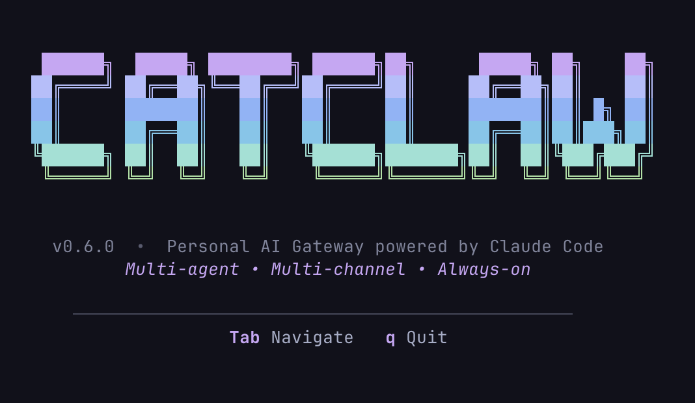

<p align="center">
  
  
  
  
</p>

<p align="center">
  
</p>

---

**English** | [繁體中文](README.zh-TW.md)

CatClaw is a Rust daemon that turns your **Claude Code subscription** into a personal AI assistant accessible from Discord, Telegram, Slack, and a beautiful terminal UI. Inspired by OpenClaw, built from scratch in Rust for performance, reliability, and full Anthropic compliance.

## Why CatClaw?

- **Use your Claude Code subscription** &mdash; no API keys, no surprise bills. CatClaw spawns `claude -p` subprocesses that use your existing Claude Code plan.
- **Multi-agent** &mdash; define multiple AI personas (main assistant, research expert, code reviewer), each with their own personality, memory, and tool permissions.
- **Multi-channel** &mdash; talk to your agents from Discord, Telegram, Slack, or the built-in TUI. All channels share the same session and memory system.
- **Tool approval system** &mdash; require user confirmation before agents execute sensitive tools (Bash, Edit, etc.) with inline approval UI in TUI and Discord/Telegram/Slack buttons.
- **Stateless gateway** &mdash; all state persisted to SQLite. Kill the daemon anytime, restart, and everything picks up where it left off.
- **Beautiful TUI** &mdash; Catppuccin Mocha themed terminal interface with 8 panels for managing everything.

## Quick Start

### Prerequisites

- [Claude Code CLI](https://docs.anthropic.com/en/docs/claude-code) installed and authenticated

### Install

```bash
curl -fsSL https://raw.githubusercontent.com/CatiesGames/catclaw/main/install.sh | sh
```

Or build from source:
```bash
git clone https://github.com/CatiesGames/catclaw.git
cd catclaw
cargo build --release
```

### Launch

```bash
catclaw onboard
```

On first run, CatClaw will:
1. Show the splash logo
2. Run the interactive setup wizard (verify Claude Code CLI, create your agent, configure channels)
3. Optionally install as a system service (auto-start on boot)
4. Start the gateway in the background
5. Launch the TUI

On subsequent runs, it skips setup and goes straight to gateway + TUI.

```bash
# Other ways to run:
catclaw onboard                   # Re-run the setup wizard
catclaw gateway start             # Start gateway in foreground
catclaw gateway start -d          # Start gateway as background daemon
catclaw gateway stop              # Stop the background gateway
catclaw gateway status            # Show gateway status
catclaw tui                       # Launch TUI only (connects to running gateway)

# Updates & auto-start:
catclaw update                    # Self-update to latest version (manual; for the human user)
catclaw update --resume           # Self-update + restart + auto-resume the current session (for the agent to call itself)
catclaw update --check            # Check for updates without installing
catclaw gateway install           # Install as system service (auto-start on boot)
catclaw gateway uninstall         # Remove the system service
catclaw uninstall                 # Full uninstall (stop, remove service, delete binary)
```

## Architecture

```
┌──────────────────────────────────────────────────────────────────┐
│                       CatClaw Gateway (Rust)                     │
│                                                                  │
│  ┌─────────────┐ ┌─────────────┐ ┌─────────────┐                 │
│  │  Discord     │ │  Telegram   │ │  Slack      │  Adapters      │
│  │  Adapter     │ │  Adapter    │ │  Adapter    │                │
│  └──────┬───────┘ └──────┬──────┘ └──────┬──────┘                │
│         └────────────────┘                                        │
│                  ▼                                                │
│  ┌────────────────────────────────────────────────────────────┐  │
│  │  Message Router  →  Agent Registry  →  Session Manager    │  │
│  │  (binding table)    (SOUL/tools)       (claude -p spawn)  │  │
│  └────────────────────────────────────────────────────────────┘  │
│                                                                  │
│  ┌──────────────────┐  ┌──────────────────┐                     │
│  │  State DB         │  │  Scheduler       │                     │
│  │  (SQLite WAL)     │  │  (cron/heartbeat)│                     │
│  └──────────────────┘  └──────────────────┘                     │
│                                                                  │
│  ┌──────────────────────────────────────────────────────────┐   │
│  │  WS Server (/ws)  +  MCP Server (/mcp)  — port 21130    │   │
│  └──────────────────────────────────────────────────────────┘   │
└──────────────────────────────────────────────────────────────────┘
          ▲                              ▲
          │ WebSocket                    │ MCP JSON-RPC
    ┌─────┴─────┐                 ┌──────┴──────┐
    │  TUI      │                 │  Claude CLI │
    │ (ratatui) │                 │  (tool use) │
    └───────────┘                 └─────────────┘
```

**How it works**: When a message arrives from any channel, CatClaw resolves which agent should handle it (via binding table), finds or creates a session, spawns a `claude -p --output-format stream-json` subprocess, and streams the response back to the originating channel.

Each `claude -p` subprocess uses your Claude Code subscription &mdash; no API keys needed.

## CLI Reference

All configuration is managed through the CLI or TUI. No manual file editing required.

### Gateway

```bash
catclaw onboard                   # Onboarding: setup wizard → start gateway → launch TUI
catclaw gateway start             # Start gateway in foreground
catclaw gateway start -d          # Start as background daemon
catclaw gateway stop              # Stop background gateway
catclaw gateway restart           # Restart daemon (manual; for the human user)
catclaw gateway restart --resume  # Restart + auto-resume the current channel session (for the agent to call itself; user does not need to ping again)
catclaw gateway status            # Show running status and PID
catclaw onboard                      # Re-run the setup wizard
catclaw tui                       # Launch TUI only
```

### Agent Management

```bash
catclaw agent new <name>                          # Create a new agent
catclaw agent list                                # List all agents
catclaw agent edit <name> <file>                  # Open file in $EDITOR
catclaw agent tools <name>                        # Show current tool permissions
catclaw agent tools <name> \
  --allow "Read,Grep,WebFetch" \
  --deny "Bash" \
  --approve "Edit,Write"                          # Configure tool permissions
catclaw agent delete <name>                       # Delete an agent
```

`<file>` values: `soul`, `user`, `identity`, `agents`, `tools`, `boot`, `heartbeat`, `memory`

### Channels

```bash
catclaw channel list                              # List configured channels
catclaw channel add discord \
  --token-env CATCLAW_DISCORD_TOKEN \
  --guilds "123456789" \
  --activation mention                            # Add Discord channel
catclaw channel add telegram \
  --token-env CATCLAW_TELEGRAM_TOKEN              # Add Telegram channel
catclaw channel add slack \
  --token-env CATCLAW_SLACK_BOT_TOKEN \
  --app-token-env CATCLAW_SLACK_APP_TOKEN         # Add Slack channel
```

### Bindings (Channel → Agent routing)

```bash
catclaw bind "discord:channel:222222" research    # Bind a channel to an agent
catclaw bind "telegram:*" main                    # Bind all Telegram to main
catclaw bind "slack:channel:C12345" research      # Bind a Slack channel to an agent
catclaw bind "*" main                             # Global fallback
catclaw unbind "discord:channel:222222"           # Remove a binding
```

Bindings hot-reload through the running gateway — no restart needed. When the gateway is offline, changes save to `catclaw.toml` and load on next start.

### Sessions

```bash
catclaw session list                              # List all sessions
catclaw session delete <key>                      # Delete a session
```

### Skills

```bash
catclaw skill list <agent>                        # List skills (built-in + installed)
catclaw skill enable <agent> <skill>              # Enable a skill
catclaw skill disable <agent> <skill>             # Disable a skill
catclaw skill install <source>                    # Install from remote source
catclaw skill uninstall <skill>                   # Remove a skill
```

Install sources: `@anthropic/<name>`, `github:<owner>/<repo>/path`, `/local/path`

### Scheduled Tasks

```bash
catclaw task list                                 # List scheduled tasks
catclaw task add <name> --agent main \
  --prompt "Check inbox" --every 30               # Repeat every 30 minutes
catclaw task add <name> --agent main \
  --prompt "Morning briefing" --cron "0 9 * * *"  # Cron schedule
catclaw task enable <id|name>                     # Enable a task (by ID or name)
catclaw task disable <id|name>                    # Disable a task
catclaw task delete <id|name>                     # Delete a task
```

### Configuration

```bash
catclaw config show                               # Show full config (TOML)
catclaw config get <key>                          # Get a specific value
catclaw config set <key> <value>                  # Set a value (hot-reload when possible)
```

### Environment variables

Tokens (LINE / Discord / Slack / Telegram / Meta) are referenced from config by `*_env` keys; the actual values live in `~/.catclaw/.env`:

```bash
catclaw env list                                  # Show all (values masked)
catclaw env set CATCLAW_LINE_CHANNEL_ACCESS_TOKEN xxx
catclaw env get <KEY>
catclaw env remove <KEY>
catclaw mcp_env set <server> <KEY> <VALUE>        # Per-MCP-server env (separate scope)
```

`catclaw onboard` does this for you when adding channels. For manual / scripted deployments use `catclaw env set` — **don't** rely on shell `export`, the daemon (`catclaw gateway start -d`) won't inherit interactive shell env.

### Logs

```bash
catclaw logs                                      # Show recent logs
catclaw logs -f                                   # Stream in real-time
catclaw logs --level debug                        # Filter by level
catclaw logs --grep "discord"                     # Search by pattern
catclaw logs --json                               # Raw JSON output
```

## TUI

The TUI provides a beautiful Catppuccin Mocha themed interface with 8 panels:

| Panel | Description |
|---|---|
| **Dashboard** | Overview with agent count, active sessions, uptime |
| **Sessions** | View all sessions, chat directly with agents, inline tool approval |
| **Agents** | Manage agents, edit personality files, configure tool permissions (allowed/denied/approval) |
| **Skills** | Enable/disable/install skills per agent |
| **Tasks** | View and manage scheduled tasks (heartbeat, cron) |
| **Bindings** | Map channels to agents |
| **Config** | View and edit gateway configuration with hot-reload |
| **Logs** | Live log viewer with search, level filter, structured fields |

**Keyboard shortcuts**: `Tab`/`Shift+Tab` cycle panels, `Alt+1-8` jump directly, `q` quit. Mouse scroll supported in Sessions and Logs.

**Chat commands**: `/new` start fresh session, `/model <name>` switch model, `/help` show help.

## Agent System

Each agent has its own workspace with personality, memory, skills, and tool permissions:

```
workspace/agents/main/
├── SOUL.md              # Personality, tone, values
├── USER.md              # Who the user is
├── IDENTITY.md          # Agent name, role
├── AGENTS.md            # Workspace conventions
├── TOOLS.md             # Tool usage guidelines
├── BOOT.md              # Startup instructions (prepended to first message)
├── HEARTBEAT.md         # Periodic check tasks
├── MEMORY.md            # Long-term memory (curated)
├── memory/              # Daily notes (YYYY-MM-DD.md)
├── transcripts/         # Session logs (JSONL)
└── tools.toml           # Tool permissions
```

### Tool Permissions

Each tool exists in exactly one of three states:

```toml
# workspace/agents/research/tools.toml
allowed = ["Read", "Grep", "Glob", "WebFetch", "WebSearch"]
denied = ["Bash"]
require_approval = ["Edit", "Write"]
```

- **allowed** &mdash; tool runs freely
- **denied** &mdash; tool is completely blocked
- **require_approval** &mdash; tool runs only after user approves (via TUI inline widget, Discord button, Telegram keyboard, or Slack Block Kit button)

Manage via TUI (Agents → `t` Tools → Space to cycle states) or CLI (`catclaw agent tools`).

### Skills

CatClaw ships with built-in skills and supports installing custom ones:

| Skill | Description |
|---|---|
| `catclaw` | CatClaw system administration (agent knows all CLI commands) |
| `discord` | Discord formatting and MCP tool usage |
| `telegram` | Telegram formatting and MCP tool usage |
| `slack` | Slack formatting and MCP tool usage |
| `sessions-history` | Query transcripts from other sessions |
| `injection-guard` | Defend against prompt injection from external content |

Skills are shared across agents via `workspace/skills/`. Each agent can enable/disable skills independently.

### User MCP Servers

Add custom MCP servers in `workspace/.mcp.json` (shared across all agents):

```json
{
  "mcpServers": {
    "my-api": {
      "type": "http",
      "url": "https://api.example.com/mcp",
      "headers": { "Authorization": "Bearer ${MY_API_KEY}" }
    }
  }
}
```

MCP tools appear in the TUI Tools panel under "User MCP Servers" and can be denied or set to require approval per agent.

## Channel Adapters

| Channel | Status | Features |
|---|---|---|
| **Discord** | ✅ | Threads, typing indicator, approval buttons, 32 MCP actions |
| **Telegram** | ✅ | Long polling, forum topics, approval keyboard, 26 MCP actions |
| **Slack** | ✅ | Socket Mode, threads, native AI streaming, approval buttons, 17 MCP actions |
| **LINE** | ✅ | Webhook + HMAC verify, reply-token + push, image/video/file inbound, 11 MCP actions (rich menu / flex / quota / profile) |
| **TUI** | ✅ | Direct chat with streaming, inline approval widget |

**Activation modes** (DMs always respond; this controls group/server channels):
- `mention` (default) &mdash; respond only when @mentioned
- `all` &mdash; respond to every message

### Built-in MCP Server

CatClaw exposes channel adapter operations as MCP tools, so agents can autonomously perform platform actions:

```
Agent wants to list Discord channels
  → Claude calls mcp__catclaw__discord_get_channels
  → CatClaw MCP server → serenity → Discord REST API
  → JSON result back to agent
```

**Discord** (32 tools): messages, reactions, pins, threads, channels, categories, permissions, guilds, members, roles, emojis, moderation, events, stickers.

**Telegram** (26 tools): messages, pins, chat info/management, moderation, polls, forum topics, permissions, invite links.

**Slack** (17 tools): messages, reactions, pins, channels, threads, users.

## Session Management

```
SessionKey = catclaw:{agent_id}:{origin}:{context_id}
```

**Lifecycle**:
```
New → Active (claude -p subprocess alive)
       ↓ idle 30 min
     Idle (subprocess exited, session_id preserved for --resume)
       ↓ idle 7 days
     Archived (summary written to memory, start fresh)
```

**Concurrency**: configurable max (default 3) with priority queue (DM > mention > cron). Excess requests queued.

**Stateless restart**: all state in SQLite. Kill and restart — sessions resume via `--resume`.

## Configuration

```toml
[general]
workspace = "./workspace"
state_db = "./state.sqlite"
max_concurrent_sessions = 3
session_idle_timeout_mins = 30
session_archive_timeout_hours = 168
port = 21130                        # WS + MCP on single port
streaming = true
default_model = "opus"              # optional: opus, sonnet, haiku

[[channels]]
type = "discord"
token_env = "CATCLAW_DISCORD_TOKEN"
guilds = ["123456789"]
activation = "mention"

[[channels]]
type = "telegram"
token_env = "CATCLAW_TELEGRAM_TOKEN"

[[channels]]
type = "slack"
token_env = "CATCLAW_SLACK_BOT_TOKEN"
app_token_env = "CATCLAW_SLACK_APP_TOKEN"
activation = "mention"

[[agents]]
id = "main"
workspace = "./workspace/agents/main"
default = true

[agents.approval]
timeout_secs = 120                  # approval timeout (global)
```

## Social Inbox

CatClaw integrates Instagram and Threads via an independent Social Inbox subsystem — separate from channel adapters. Events flow: poll/webhook → dedup → rule-based action router → forward card or auto-reply draft → staged admin approval → send via Meta API.

### Architecture

```
Instagram Graph API ──┐
                       ├─→ SocialItem channel ─→ run_ingest()
Threads API ──────────┘         │
Webhook (POST /webhook/*)        ↓
                          action router (rules)
                               │
         ┌─────────────────────┼──────────────────┐
         ↓                     ↓                  ↓
      forward              auto_reply          template / ignore
      card → admin       Claude session →      call Meta API
      [AI Reply]         stage_reply →         directly
      [Manual Reply]     draft review card →
      [Ignore]           admin approves →
                         call Meta API
```

### Config

```toml
[social.instagram]
mode = "polling"                           # polling | webhook | off
poll_interval_mins = 5
token_env = "INSTAGRAM_TOKEN"              # System User Token env var (never expires)
app_secret_env = "INSTAGRAM_APP_SECRET"   # For HMAC webhook verification
user_id = "17841412345678"
admin_channel = "discord:channel:123456"  # Forward card destination
agent = "main"

[[social.instagram.rules]]
match = "comments"        # event type: comments | mentions | messages | *
action = "forward"        # forward | auto_reply | auto_reply_template | ignore

[[social.instagram.rules]]
match = "mentions"
keyword = "price"         # optional keyword filter
action = "auto_reply"
agent = "support"

[[social.instagram.rules]]
match = "*"
action = "ignore"

[social.instagram.templates]
default_mention = "Thank you for the mention! We will be in touch soon."

[social.threads]
mode = "polling"
poll_interval_mins = 3
token_env = "THREADS_TOKEN"               # Threads OAuth token (expires 60 days)
app_secret_env = "THREADS_APP_SECRET"
user_id = "12345678"
admin_channel = "slack:channel:C0A9FFY7QAZ"
agent = "main"

[[social.threads.rules]]
match = "replies"
action = "forward"

[[social.threads.rules]]
match = "*"
action = "ignore"
```

### Webhook Setup

Add `webhook_verify_token_env` to the config and register the callback URL in Meta Developer Console:

```
GET/POST https://yourhost:PORT/webhook/instagram
GET/POST https://yourhost:PORT/webhook/threads
```

The GET handler validates `hub.verify_token`; the POST handler verifies HMAC-SHA256 signature against the app secret.

### CLI

```bash
catclaw social inbox                              # List all inbox items
catclaw social inbox --platform instagram         # Filter by platform
catclaw social inbox --status pending             # Filter by status
catclaw social poll instagram                     # Trigger manual poll
catclaw social mode instagram polling             # Switch mode (hot-reload)
catclaw social reprocess <id>                     # Reset inbox item, restore card with buttons,
                                                   # re-run the action router (recovery tool for stuck cards)
```

Discord also exposes `/social-reprocess id:<id>` as a slash command for the same purpose.

### TUI

Alt+9 opens the Social Inbox tab. Use Tab/BackTab to filter by status, Enter to view details, A to approve a draft, D to discard.

### Agent MCP Tools

When social is configured, agents get `instagram_*` and `threads_*` MCP tools for direct API access. The `*_stage_reply` tools store a draft and trigger an admin review card — no approval hook needed.

---

## Contacts

Cross-platform identity layer. CatClaw stores **who** you talk to (across Discord/Telegram/Slack/LINE) plus forward & approval rules — but **not the business data**. Business data (nutrition logs, training records, counseling notes, etc.) is the agent's responsibility — store wherever fits (Notion MCP, memory palace, your own SQLite).

**Use when**: a single user (nutritionist / trainer / consultant / customer-service rep) manages multiple "clients" through the bot, and wants per-client routing, approval, or AI pause/resume.

**Enable** (off by default to save ~3-4KB tokens per agent conversation):
```bash
catclaw config set contacts.enabled true
```
When disabled, `contacts_*` MCP tools are not advertised to agents. Schema, CLI, and TUI remain functional — you can still build up contacts manually before flipping the switch.

**Auto-registration of unknown contacts (LINE)**: when enabled, every LINE inbound sender (including follow events) is auto-registered as a `role=unknown` contact — **no LLM invoked**. These are storage-only until promoted to `client`/`admin` via `contacts_update`. This prevents strangers adding your OA from burning agent tokens. Optionally mirror unknown inbound to a channel for admin review:
```bash
catclaw config set contacts.unknown_inbox_channel "discord:guild_id/channel_id"
```
If unset, unknown inbound is only logged (`info!`); browse via TUI Contacts tab or `catclaw contact list --role unknown`.

Unfollow events on LINE set `ai_paused=true` + tag `unfollowed` on the corresponding contact, preserving history.

### Schema

| Table | Purpose |
|---|---|
| `contacts` | id, agent_id, display_name, role (admin/client/unknown), tags, forward_channel, approval_required, ai_paused, external_ref (JSON), metadata (JSON) |
| `contact_channels` | (platform, platform_user_id) → contact_id, with last_active_at for routing |
| `contact_drafts` | Outbound draft queue (status: pending → awaiting_approval → sent / ignored / revising / failed) |

### Outbound pipeline

```
agent → contacts_reply → draft → mirror to forward channel
                              → approval gate (if approval_required)
                              → adapter.send (platform = via OR last_active)
                              → status=sent / failed
```

The agent **cannot bypass** this pipeline — direct calls to platform native send tools won't go through forward + approval. Always use `contacts_reply`.

### Inbound flow

When an inbound message comes from a sender bound to a contact:
1. `contact_channels.last_active_at` is touched (used for last-active routing).
2. The message is mirrored to `forward_channel` (if set).
3. If `ai_paused` is true → mirror only, agent is **not** invoked.
4. Otherwise the agent receives the message with `[Contact: name=…, role=…, tags=…, external_ref=…, metadata=…]` injected into the system prompt.

A message arriving in a forward_channel (admin's monitoring channel) and not bound to a contact is treated as a **manual reply** — forwarded to the corresponding contact directly under the agent's identity, bypassing the agent.

### CLI

```bash
catclaw contact add <name> [--role admin|client|unknown] [--tag ...] [--no-approval]
catclaw contact list [--agent ID] [--role ...]
catclaw contact show <id>
catclaw contact update <id> [--name ...] [--role ...] [--forward-channel ...] [--approval|--no-approval]
catclaw contact bind <id> --platform line --user-id U123...
catclaw contact unbind --platform line --user-id U123...
catclaw contact pause <id>
catclaw contact resume <id>
catclaw contact draft list [--status ...]
catclaw contact draft approve <draft_id>
catclaw contact draft discard <draft_id>
```

### TUI

`Contacts` tab provides two sub-views (Tab toggles):
- **Contacts**: list + role/tags/forward/approval/paused; `P`=toggle pause, `A`=toggle approval
- **Drafts**: outbound draft queue; `a`=approve, `D`=discard

### Agent MCP Tools

`contacts_create / get / list / update / delete / bind_channel / unbind_channel / reply / ai_pause / ai_resume / drafts_list / draft_approve / draft_discard / draft_request_revision`

`contacts_reply` payload supports `{type:"text"}`, `{type:"image"}`, `{type:"flex"}` (LINE-only Flex passes through to the LINE adapter).

### Multi-agent extension path

v1 binds each contact to a single agent (`contacts.agent_id`). All read paths go through `Contact::owning_agents() -> Vec<AgentId>` which currently returns one entry. To support sharing a contact across multiple agents in v2, migrate to a `contact_agents` join table and update the helper — call sites unchanged.

---

## LINE (optional channel)

LINE Messaging API integration. **Optional** — the adapter only starts when a `line` channel is configured; otherwise zero impact on the rest of the system.

### Setup

You need:
- A LINE Official Account with Messaging API enabled
- Channel Access Token (long-lived) → set `LINE_CHANNEL_ACCESS_TOKEN`
- Channel Secret → set `LINE_CHANNEL_SECRET`
- A public HTTPS endpoint (cloudflared / ngrok / your own domain) pointing at the gateway port

### Config

```toml
[[channels]]
type = "line"
token_env = "LINE_CHANNEL_ACCESS_TOKEN"
secret_env = "LINE_CHANNEL_SECRET"
```

In LINE Developer Console, set the webhook URL to `https://your.host/webhook/line` and verify.

### Capabilities

- **Inbound**: text, image, video, audio, file (auto-download via Content API + Bearer token), follow / unfollow / postback events
- **Outbound**: 5-minute reply-token (free) → fallback to push API (counts toward quota)
- **HMAC-SHA256** signature verification on every webhook delivery
- **Rich Menu** fully managed by the agent — CatClaw stores no menu↔role mapping

### Agent MCP Tools (`line_*`)

| Tool | Purpose |
|---|---|
| `line_rich_menu_create` | Create a rich menu |
| `line_rich_menu_upload_image` | Upload background image (JPEG/PNG) |
| `line_rich_menu_list` | List all menus |
| `line_rich_menu_delete` | Delete a menu |
| `line_rich_menu_set_default` | Set as OA-wide default |
| `line_rich_menu_link_user` | Apply menu to specific user |
| `line_rich_menu_unlink_user` | Remove per-user override |
| `line_get_quota` | Push API monthly quota |
| `line_get_profile` | LINE user displayName + picture URL |
| `line_send_flex` | Send Flex message |
| `line_show_loading` | Show loading animation in 1:1 chat |

For LINE-side outbound to actual contacts, use `contacts_reply` (which routes through the contacts pipeline). `line_send_flex` is for direct out-of-band Flex sends (e.g. broadcasts not tied to a contact).

---

## Tech Stack

| Component | Crate |
|---|---|
| Async runtime | `tokio` |
| Discord | `serenity` + `poise` |
| Telegram | `teloxide` |
| Slack | `reqwest` + `tokio-tungstenite` (Socket Mode) |
| HTTP server (WS + MCP) | `axum` |
| CLI | `clap` (derive) |
| Database | `rusqlite` (bundled SQLite, WAL) |
| TUI | `ratatui` + `crossterm` + `tui-textarea` |
| Config | `toml` + `serde` |
| Scheduling | `croner` (cron expressions) |
| Logging | `tracing` |

## Feedback

Found a bug or have a feature request? [Open an issue](https://github.com/CatiesGames/catclaw/issues).

## License

MIT

---

<p align="center">
  Built with Rust and Claude Code<br>
  <strong>CatiesGames</strong>
</p>
